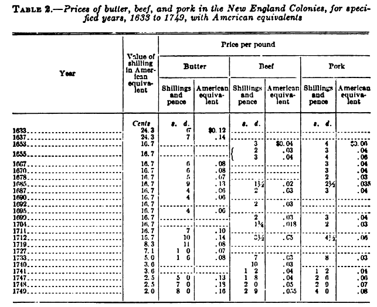
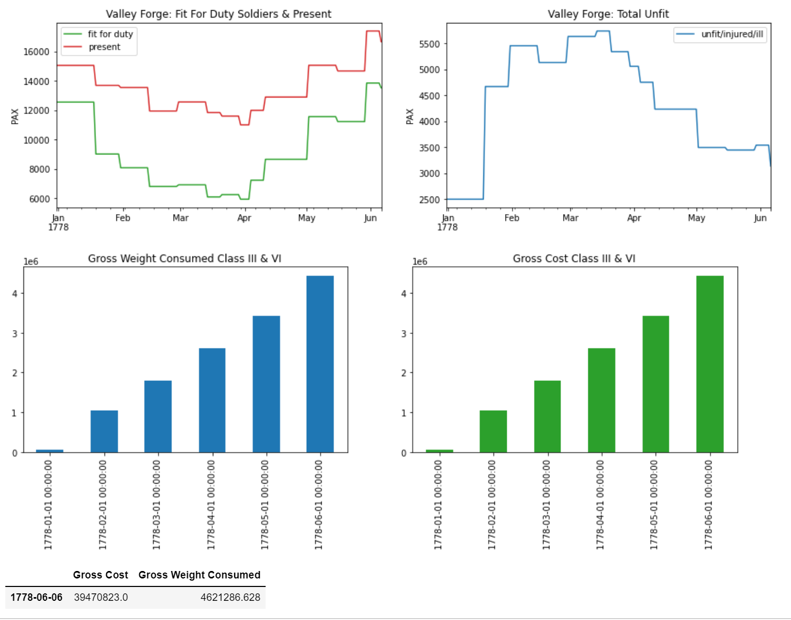
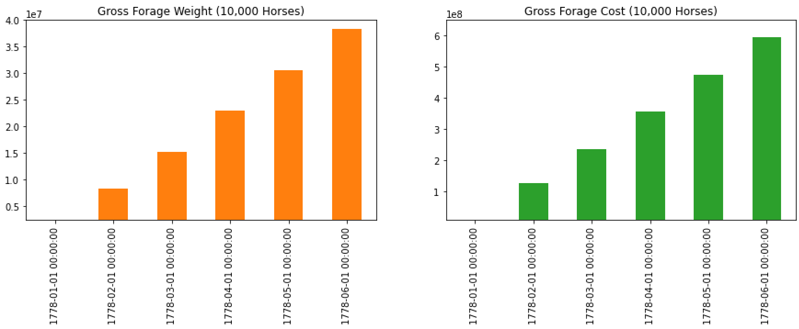

 # Washingtons Logistics Why?
 ## because AMSP and Datascience... and Dungeon Masters (naturally) 
 
 
### Class I and VI Requirements

#### 1777 Proposed Daily Ration by General Washington and Board of General Officers [1](#fn1)
- 1 1/4 lb. of beef or 1 lb. pork, or 1 1/4 lb. of salt fish. 
- 1 lb. of flour, or soft bread, or 1 lb. of hard bread. 
- 1/2 gill of rum or whisky per day in lieu of beer. 
- 1/2 pt. of rice, or  1 pt. of Indian meal per week. 
- 3 lbs. of candles to 100 men per week
- 24 lbs. of soft soap or 8 lbs. of hard soap per 100 men per week.
- estimated to cost 3 shillings and 4 pence, exclusive of soap and candles

**Note:** cost estimate seems low but it could be a local spike, missing pages between 1740-1790[4](#fn4)

#### Simplified Table of Daily Rations Per Person

|Item    | Weight LB | Calories | Class of Supply  | Cost Todays USD | Notes                             |
|:-------|:----------|:---------|:-----------------|:----------------|:----------------------------------|
|Meat    | 1 LB      | 651      | Class I          | 11.20           | dropped types                     |
|flour   | 1 LB      | 1651     | Class I          | 3.10            | calories based on google estimate |
|alcohol | 0.156 LB  | 163      | Class VI         | 4.10            | 2.5 oz or Half a teacup           |
|soap    | 0.01 LB   | NA       | Class VI         | 0.10            | weight = rnd(8/7/100)             |
|Total   | 2.166 LB  | 2465     | Classes I,VI     | 18.50           | Combined Classes of Supply        |

**Note:** conversion of monies is based on 1780 english value converted to 2017 UK LBs (14.35) then converted to USD (18.50) with the average 2017 exchange rate (1.289).[2](#fn2) [3](#fn3) The indvidual cost break down is just an authors assumption of relative price based on 3 Shiling 4 pence total.   

 

| Food Source                            | Ave Weight or Area               | Meat/Plant weight              | 
|----------------------------------------|----------------------------------|--------------------------------|
| Red Devons Cow[4](#fn5)     |  1,100 lbs[5](#fn6)   | 490 lbs [5](#fn7)   |
| Dominique Chicken [5](#fn8) |  7 lbs[5](#fn9)       | 5 lbs[5](#fn10)     |
| Wheat[5](#fn11)             |  ~10 ftsq[5](#fn12)   | 1 lbs                          |

https://allthingsliberty.com/2021/05/a-reconsideration-of-continental-army-numerical-strength-at-valley-forge/

    
1. Erna Risch, Supplying Washington's Army, (Washington, D.C.: Center of Military History, United States Army, 1981), 191.

2. https://libraryguides.missouri.edu/pricesandwages/1780-1789

3. https://www.exchangerates.org.uk/GBP-USD-spot-exchange-rates-history-2017.html 

4. https://libraryguides.missouri.edu/pricesandwages/1780-1789

5. https://www.hhhistory.com/2017/07/farm-animals-in-colonial-times.htm

6. https://www.thecattlesite.com/breeds/dairy/35/milking-devon/

7. https://extension.sdstate.edu/how-much-meat-can-you-expect-fed-steer

8. https://www.hhhistory.com/2017/07/farm-animals-in-colonial-times.html

9. https://en.wikipedia.org/wiki/Dominique_chicken

10. https://digitalcommons.lsu.edu/cgi/viewcontent.cgi?article=1774&context=agexp 

11. https://flour.com/flour/

12. http://www.waldeneffect.org/blog/How_much_space_do_I_need_to_grow_my_own_grains__63__/

### Class III (AKA Forage) Requirements

#### Thomas Mifflin was reappointed Quartermaster General in 1776, the increased demands for forage in New York required his immediate had indicated were necessary for the support of the main army. Congress furnished him 300,000 dollars to procure the supplies he had indicated were necessary for the support of the main army. These supplies included, among other items, 25,000 bushels of Indian com, 15,000 bushels of oats, 10,000 bushels each of rye meal and spe llS, and 1,800 tons of hay. [13](#fn13)

#### To provide forage for the horses, the Cavalry was dispersed to Durham, Connecticut; Lancaster, Pennsylvania; and Winchester, Virginia. Forage had to be provided not only for the Cavalry horses but also for the main army's riding and wagon horses. Biddle estimated the total number at 10,000 [14](#fn14)

#### An adult horse at maintenance will consume between 2 – 2.5% of their bodyweight in feed (hay and grain) each day. For example, a 1,000 pound horse fed a 100% hay diet would consume 25 pounds of hay each day. In the Winter i.e. no grass for grazing. [15](#fn15) Hay was 60 to 80 dollars a ton [15](#fn16)

|Item           | Weight LB | Storage Mode[17](#fn17) | Class of Supply | Historical         | Cost Todays USD |
|:--------------|:----------|:-----------------------------------|:----------------|:-------------------|-----------------|
|hay per hourse | 25 LB     | screwed 800lb                      | Class III       | 80 dollars per ton |1,243.36 dollars per ton|

- **DOS per horse**
    - 25LB at 15.54 dollars
- **DOS army**
    - 250,000LB at 3,885,000 dollars

13. Erna Risch, Supplying Washington's Army, (Washington, D.C.: Center of Military History, United States Army, 1981), 100.13
   
14. Ibid, 112.14
    
15. https://www.horsefeedblog.com/2015/11/estimating-winter-hay-needs/ 
    
16.13. Erna Risch, Supplying Washington's Army, (Washington, D.C.: Center of Military History, United States Army, 1981), 109. \
   
17. http://www.generalatomic.com/AmericanHistory/evacuation_of_boston.html 
